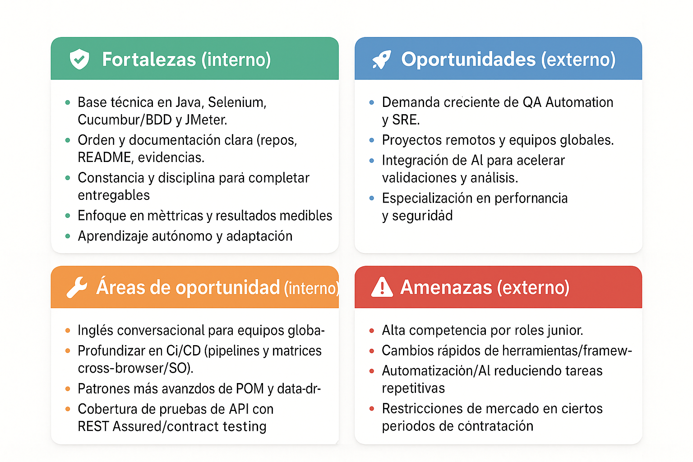

[Ver informe en PDF](<docs/Proyecto ABP Prepárate para el mercado laboral.pdf>)

# Portafolio QA – Pamela Gutiérrez Zamorano

> **Sobre mí**  
> Soy Pamela Gutiérrez, QA Automation en formación con base en Java, Selenium WebDriver y Cucumber/BDD; también realizo pruebas de performance con Apache JMeter. Trabajo con Git/Maven y publico reportes reproducibles (HTML en GitHub Pages). Me distingo por el orden, la documentación clara y el foco en métricas (P95, tasa de errores, throughput). Busco mi primera experiencia en un equipo que valore el aprendizaje continuo: llego lista para automatizar flujos críticos y convertir resultados en insights accionables para el negocio.

## Contacto
- **GitHub:** [PameGutierrez](https://github.com/PameGutierrez)
- **Ciudad:** Temuco, Chile

---

## Proyectos destacados del curso (3)
| Proyecto | Descripción breve | Enlace |
|---|---|---|
| M5 – BDD con Cucumber + Selenium | Escenarios Gherkin con Page Object Model y Hooks para orden y reutilización. | https://pamegutierrez.github.io/ABP_Modulo5_Escenarios_de_Comportamiento_BDD/ |
| M7 – Performance con Apache JMeter | Simulación de 10 usuarios concurrentes; dashboard HTML publicado en GitHub Pages. | https://pamegutierrez.github.io/M7_Evaluacion_Rendimiento_Pame/jmeter-dashboard/ |
| L6 – Utilización de Hooks (Selenium) | Centralización de setup/teardown del navegador para evitar duplicación en Steps. | https://github.com/PameGutierrez/L6_Utilizaci-nDeHooks |

---

## Caso de estudio: Performance con Apache JMeter

### Descripción breve
Simulación de **10 usuarios concurrentes** ejecutando el flujo **login → búsqueda → agregar al carrito → logout**, con **2 iteraciones** por usuario.

### Desafío principal
Validar estabilidad y tiempos de respuesta bajo carga realista con criterios medibles.

### Solución propuesta
- **Thread Group:** 10 VUs, ramp-up 10 s, loops 2  
- **Transaction Controller** para medir punta a punta  
- **Assertions por sampler** (contenido/tiempo)  
- **Export del Dashboard HTML** y publicación en **GitHub Pages**

### Herramienta técnica utilizada
Apache JMeter

### Aprendizajes clave
- Interpretación de **percentiles (P90/P95)** para evaluar experiencias típicas y peores casos.  
- Uso de **desviación estándar** para apreciar estabilidad/variabilidad.  
- Lectura de **throughput** para dimensionar capacidad.

### Métricas de impacto (ejemplo)
- **P95** de búsqueda < **1.5 s**  
- **Error rate < 1%** en el flujo completo  
- **Throughput estable** a 10 VUs durante 2 iteraciones

### Habilidades técnicas aplicadas
JMeter, diseño de escenarios representativos, análisis de métricas, control de versiones y reporte reproducible.

### Justificación
Elegí este proyecto porque demuestra mi progreso en performance, permite compartir resultados de forma pública y fomenta feedback rápido.

### Enlaces
- **Dashboard:** https://pamegutierrez.github.io/M7_Evaluacion_Rendimiento_Pame/jmeter-dashboard/  
- **Repo base:** https://github.com/PameGutierrez/M7_Evaluacion_Rendimiento_Pame

---

---

## Créditos
Hecho por **Pamela Gutiérrez Zamorano** (Pame).
